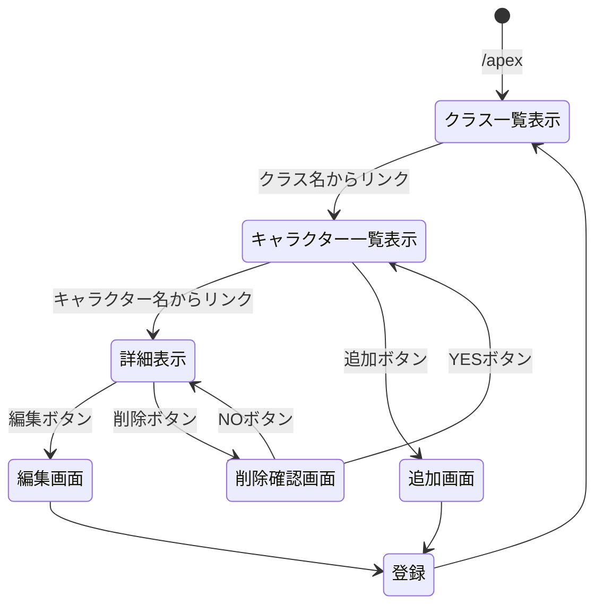

#　開発者向け仕様書

```mermaid
stateDiagram-v2
    [*] --> クラス一覧表示:/apex
   クラス一覧表示 --> キャラクター一覧表示: クラス名からリンク
   キャラクター一覧表示 -->　詳細表示: キャラクター名からリンク 
   
    詳細表示 --> 編集画面: 編集ボタン
    編集画面 --> 登録
    登録 --> クラス一覧表示
    キャラクター一覧表示 --> 追加画面: 追加ボタン
    追加画面 --> 登録

    詳細表示 --> 削除確認画面: 削除ボタン
    削除確認画面 --> キャラクター一覧表示: YESボタン
    削除確認画面 --> 詳細表示: NOボタン
```